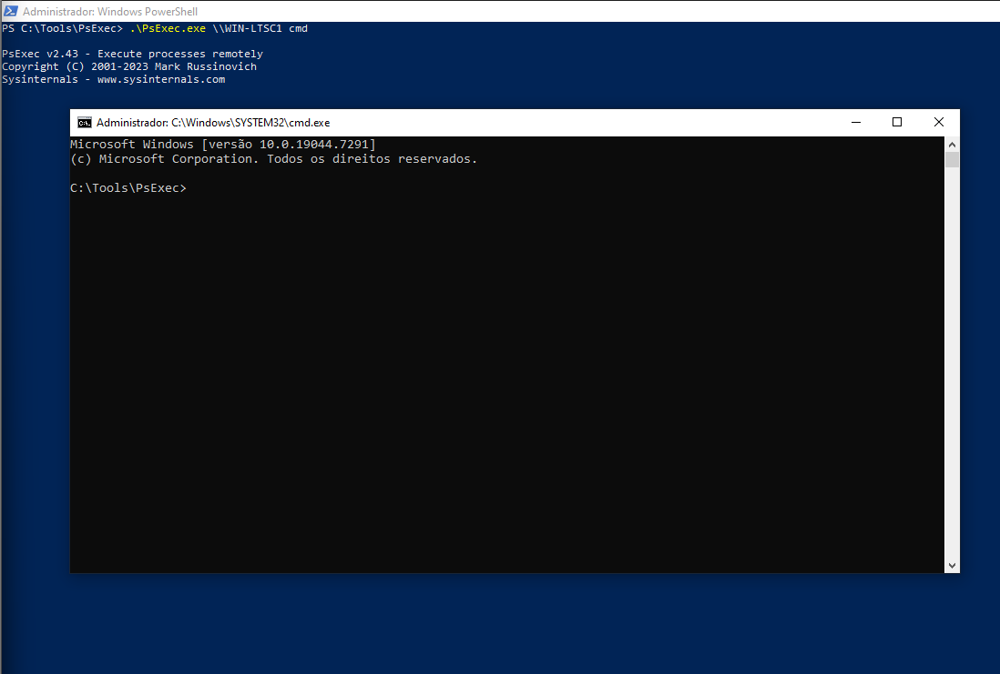

# Incident Report 001

## Incident Name

PsExec Lateral Movement Simulation

## Date

28/05/2026

## Analyst

Fernando Andrade

## Severity

Medium

## Status

Closed

## Executive Summary

A lateral movement attack simulation was carried out using PsExec within a controlled laboratory environment.

The attack resulted in Sysmon logs, was detected by Wazuh, associated with the relevant MITRE ATT&CK technique and automatically notified via Discord webhook.

The purpose of the simulation was to test the detection and response capabilities of the SOC lab environment.

## Environment

### Infrastructure

- Wazuh Manager
- Windows Server Domain Controller
- Windows LTSC Workstation
- Sysmon
- Active Directory
- Discord Integration

### Network

| Host Name     | Purpose                  |
|---------------|--------------------------|
| DC01          | Domain Controller        |
| WIN-LTSC1     | Workstation              |
| Wazuh Manager | SIEM / Log Analysis      |

### Monitoring Modules

- Sysmon Event Collection
- Windows Security Logs
- Wazuh Correlation Engine
- MITRE ATT&CK Framework
- Discord Alerting

### Detection Scenarios

The network had been set up for monitoring scenarios such as:

- Process Creation Events
- Authentication Events
- PowerShell Command Execution
- Lateral Movement Tactics
- AD Operations
- Privilege Escalation Scenarios

## Attack Simulation

Command used to simulate the attack:

PsExec.exe \\WIN-LTSC1 cmd

Purpose of this attack was to mimic a lateral movement activity between the two hosts.

## Evidence Collection

### Evidence 1 - PsExec Execution

Command used to simulate the attack:

PsExec.exe \\WIN-LTSC1 cmd

**Evidence Screenshot**

---

### Evidence 2 - Sysmon Detection

An Sysmon Event ID 1 was triggered indicating the creation of a process.

Evidence highlights:

- Parent Process: PsExec.exe
- Child Process: cmd.exe

**Evidence Screenshot**

---

### Evidence 3 - Wazuh Alert

Alert triggered by Wazuh as part of its rule set for suspicious activities:

Evidence highlights:

- Rule ID: 92052
- Description: Windows command prompt started by an abnormal process

**Evidence Screenshot**

---

### Evidence 4 – MITRE Dashboard

The event was captured by the Wazuh dashboard.

Elements seen:

- MITRE Techniques
- MITRE Tactics
- Timeline
- Host activity

**Evidence Screenshot**

---

### Evidence 5 – Discord Notification

The custom rule enabled successful Discord notification functionality.

Important points:

- Rule ID: 100550
- Alert level: 12
- Detection Type: Lateral Movement

**Evidence Screenshot**

## Analysis

The behavior seen is typical of remote execution using PsExec.

The Sysmon sensor picked up a suspicious parent-child process relationship where PsExec.exe executed cmd.exe remotely on WIN-LTSC1.

This may be legitimate when performed by an administrator; however, it is often a technique associated with lateral movement in hand-on-keyboard activities and red teaming as well as ransomware attacks.

In this lab environment, the behavior was expected and performed for validating purpose. In any other production environment, this would require additional investigation because of the privileged account involvement and remote execution behavior.

Indicators seen:

- Parent Process: PsExec.exe
- Child Process: cmd.exe
- Target: WIN-LTSC1
- Account Used: LAB\Administrator
- Wazuh Rule: 92052
- Custom Rule: 100550
- Severity: Medium

## MITRE ATT&CK Mapping

### T1021 – Remote Services

PsExec remotely executed commands on the target host.

### T1059.003 – Windows Command Shell

Command line shell executed on the target using PsExec.

### T1569.002 – Service Execution

PsExec uses windows services to remotely execute commands.

## Detection Logic

Flow of Detection:

1. Sysmon event id 1 monitored process creation.
2. Wazuh generated default rule 92052.
3. Custom correlation rule 100550 increased severity because PsExec.exe was determined to be the parent process.
4. The alert was sent to Discord via webhook.

## Response Actions

The following were carried out during the response to the threat:

- Parent-child process relationship validated.
- Originating from an authorized admin account.
- Telemetry from Sysmon correlated with the alerts in Wazuh.
- MITRE ATT&CK mapping verified.
- Delivery to Discord verified.
- Activity as part of a lab simulation confirmed.

## Indicators of Compromise (IOC)

| Type             | Value                         |
|------------------|-------------------------------|
| Parent Process   | PsExec.exe                    |
| Child Process    | cmd.exe                       |
| User             | LAB\Administrator             |
| Source Host      | DC01                          |
| Target Host      | WIN-LTSC1                     |
| Detection Rule   | 92052                         |
| Custom Rule      | 100550                        |
| MITRE Techniques | T1021, T1059.003, T1569.002   |

## Takeaways

- Custom rules for Wazuh greatly increase the accuracy of detections.
- Discord integration can be used as an alternative to full-fledged alerting platforms.
- The parent-child process relationship opens up great detection options.
- Sysmon telemetry is vital to endpoint detection and response.

## Conclusion

The SOC lab was able to detect and correlate a simulated lateral movement attack that utilized PsExec as part of its attack vectors.

The following elements were shown in the simulation:

- Collection of endpoint telemetry using Sysmon.
- Detection of the attack vector using Wazuh within the SIEM platform.
- Custom rule correlation.
- MITRE ATT&CK mapping.
- Forwarding alerts through Discord integration.

# Tradução para Português (Brasil)

# Relatório de Incidente 001

## Nome do Incidente

Simulação de movimento lateral PsExec

## Data

28/05/2026

## Analista

Fernanda Andrade

## Gravidade

Médio

## Status

Fechado

## Resumo

Uma simulação de ataque de movimento lateral foi realizada usando PsExec em um ambiente de laboratório controlado.

O ataque resultou em logs do Sysmon, foi detectado pelo Wazuh, associado à técnica MITRE ATT&CK relevante e notificado automaticamente via webhook do Discord.

O objetivo da simulação foi testar as capacidades de detecção e resposta do ambiente de laboratório SOC.

## Meio Utilizado

### Infraestrutura

- Gerente Wazuh
- Controlador de domínio do Windows Server
- Estação de trabalho Windows LTSC
- Sysmon
- Diretório Ativo
- Integração de discórdia

### Rede

| Nome do HOST      | Finalidade             |
|-------------------|------------------------|
| DC01              | Controlador de Domínio |
| WIN-LTSC1         | Estação de trabalho    |
| Wazuh             | SIEM/Análise de Log    |

### Módulos de monitoramento

- Coleção de eventos Sysmon
- Registros de segurança do Windows
- Mecanismo de correlação Wazuh
- Estrutura MITRE ATT&CK
- Alerta de discórdia

### Cenários de detecção

A rede foi configurada para monitorar cenários como:

- Eventos de criação de processos
- Eventos de autenticação
- Execução de comandos do PowerShell
- Táticas de Movimento Lateral
- Operações do Active Directory
- Cenários de escalonamento de privilégios

## Simulação do ataque

Comando usado para simular o ataque:

PsExec.exe\WIN-LTSC1cmd

O objetivo deste ataque era imitar um movimento lateral entre os dois HOSTS.

## Coleta de evidências

### Evidência 1 – Execução PsExec

Comando usado para simular o ataque:

PsExec.exe\WIN-LTSC1 cmd

Captura de tela:
01-psexec-command.png

---

### Evidência 2 - Detecção de Sysmon

Um Sysmon Event ID 1 foi acionado indicando a criação de um processo.

Destaques das evidências:

- Processo pai: PsExec.exe
- Processo filho: cmd.exe

Captura de tela:
02-sysmon-psexec-detection.png

---

### Evidência 3 - Alerta Wazuh

Alerta acionado pelo Wazuh como parte de seu conjunto de regras para atividades suspeitas:

Destaques das evidências:

- ID da regra: 92052
- Descrição: prompt de comando do Windows iniciado por um processo anormal

Captura de tela:
03-wazuh-alert-psexec.png

---

### Evidência 4 – Painel MITRE

O evento foi capturado pelo painel do Wazuh.

Elementos vistos:

- Técnicas MITRE
- Táticas MITRE
- Linha do tempo
- Atividade do anfitrião

Captura de tela:
04-mitre-dashboard.png

---

### Evidência 5 – Notificação de discórdia

A regra personalizada habilitou a funcionalidade de notificação do Discord com sucesso.

Pontos importantes:

- ID da regra: 100550
- Nível de alerta: 12
Tipo de detecção: movimento lateral

Captura de tela:
05-discord-alert-psexec.png

## Análise

O comportamento visto é típico de execução remota usando PsExec.

O sensor Sysmon detectou uma relação suspeita de processo pai-filho onde PsExec.exe executou cmd.exe remotamente no WIN-LTSC1.

Isto pode ser legítimo quando realizado por um administrador; no entanto, muitas vezes é uma técnica associada ao movimento lateral em atividades manuais no teclado e red teaming, bem como ataques de ransomware.

Neste ambiente de laboratório, o comportamento foi esperado e executado para fins de validação. Em qualquer outro ambiente de produção, isso exigiria investigação adicional devido ao envolvimento de contas privilegiadas e ao comportamento de execução remota.

Indicadores vistos:

- Processo pai: PsExec.exe
- Processo filho: cmd.exe
- Alvo: WIN-LTSC1
- Conta usada: LAB\Administrador
- Regra Wazuh: 92052
- Regra personalizada: 100550
- Gravidade: Média

## Mapeamento MITRE ATT&CK

### T1021 – Serviços Remotos

PsExec executou comandos remotamente no host de destino.

### T1059.003 – Shell de comando do Windows

Shell de linha de comando executado no destino usando PsExec.

### T1569.002 – Execução de Serviço

PsExec usa serviços do Windows para executar comandos remotamente.

## Lógica de Detecção

Fluxo de Detecção:

1. O ID de evento 1 do Sysmon monitorou a criação do processo.
2. Wazuh gerou a regra padrão 92052.
3. A regra de correlação personalizada 100550 aumentou a gravidade porque PsExec.exe foi determinado como o processo pai.
4. O alerta foi enviado ao Discord via webhook.

## Ações de resposta

O seguinte foi realizado durante a resposta à ameaça:

- Relacionamento do processo pai-filho validado.
- Originário de uma conta de administrador autorizada.
- Telemetria do Sysmon correlacionada com os alertas do Wazuh.
- Mapeamento MITRE ATT&CK verificado.
- Entrega ao Discord verificada.
- Atividade como parte de uma simulação de laboratório confirmada.

## Indicadores de Compromisso (IOC)

| Tipo                  | Valor                       |
|-----------------------|-----------------------------|
| Processo pai          | PsExec.exe                  |
| Processo filho        | cmd.exe                     |
| Usuário               | LABORATÓRIO\Administrador   |
| Anfitrião de origem   | DC01                        |
| Host alvo             | WIN-LTSC1                   |
| Regra de detecção     | 92052                       |
| Regra personalizada   | 100550                      |
| Técnicas MITRE        | T1021, T1059.003, T1569.002 |

## Conclusões

- Regras personalizadas para Wazuh aumentam muito a precisão das detecções.
- A integração do Discord pode ser usada como uma alternativa às plataformas de alerta completas.
- O relacionamento do processo pai-filho abre ótimas opções de detecção.
- A telemetria Sysmon é vital para detecção e resposta de endpoint.

## Conclusão

O laboratório SOC foi capaz de detectar e correlacionar um ataque de movimento lateral simulado que utilizava PsExec como parte de seus vetores de ataque.

Os seguintes elementos foram mostrados na simulação:

- Coleta de telemetria de endpoint utilizando Sysmon.
- Detecção do vetor de ataque utilizando Wazuh dentro da plataforma SIEM.
- Correlação de regras personalizadas.
- Mapeamento MITRE ATT&CK.
- Encaminhamento de alertas através da integração do Discord.

