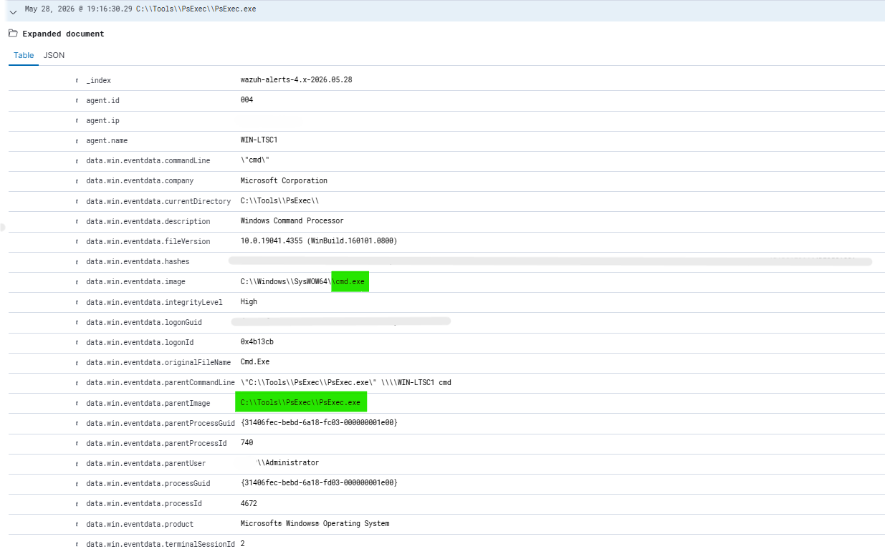
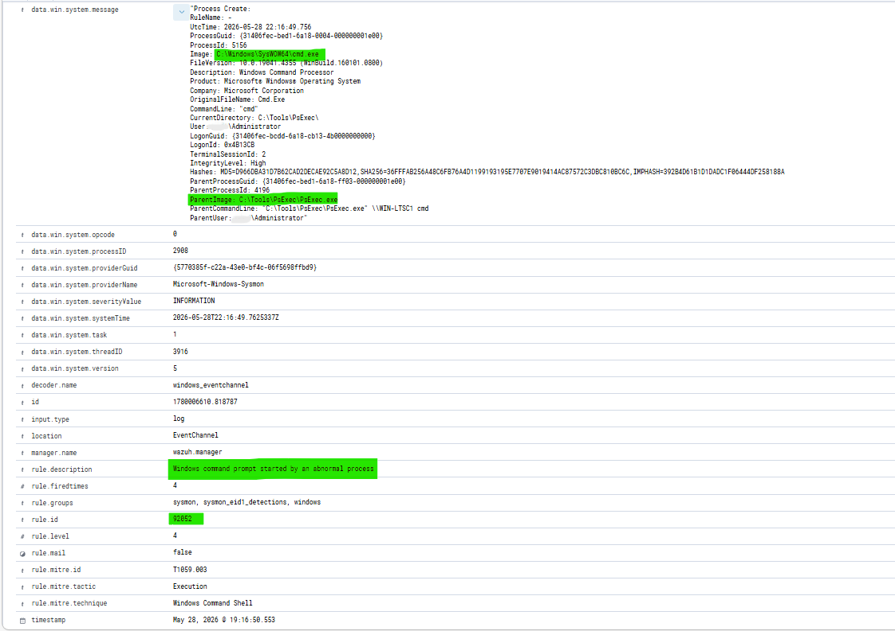
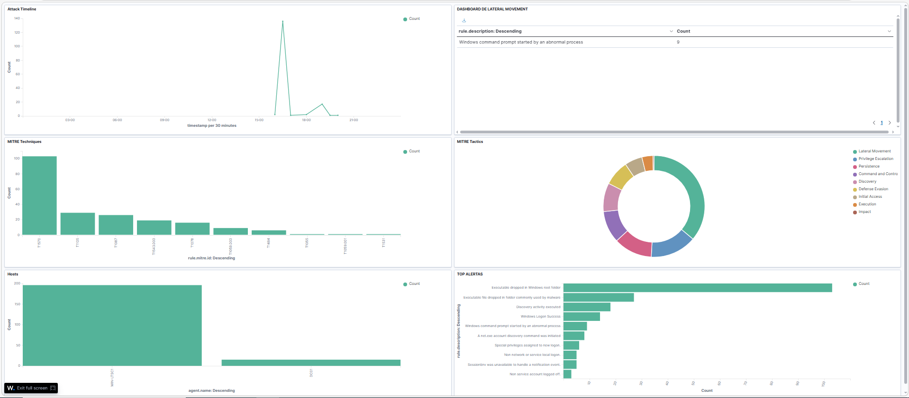
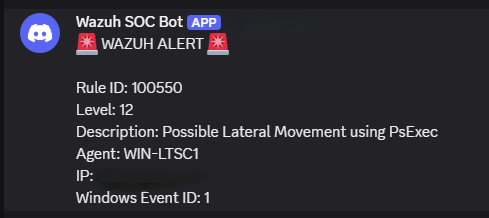

# Incident Report 001

## Incident Name

PsExec Lateral Movement Simulation

## Date

28/05/2026

## Analyst

Fernando Andrade

## Severity

Medium

## Status

Closed

## Executive Summary

A lateral movement attack simulation was carried out using PsExec within a controlled laboratory environment.

The attack resulted in Sysmon logs, was detected by Wazuh, associated with the relevant MITRE ATT&CK technique and automatically notified via Discord webhook.

The purpose of the simulation was to test the detection and response capabilities of the SOC lab environment.

## Environment

### Infrastructure

- Wazuh Manager
- Windows Server Domain Controller
- Windows LTSC Workstation
- Sysmon
- Active Directory
- Discord Integration

### Network

| Host Name     | Purpose                  |
|---------------|--------------------------|
| DC01          | Domain Controller        |
| WIN-LTSC1     | Workstation              |
| Wazuh Manager | SIEM / Log Analysis      |

### Monitoring Modules

- Sysmon Event Collection
- Windows Security Logs
- Wazuh Correlation Engine
- MITRE ATT&CK Framework
- Discord Alerting

### Detection Scenarios

The network had been set up for monitoring scenarios such as:

- Process Creation Events
- Authentication Events
- PowerShell Command Execution
- Lateral Movement Tactics
- AD Operations
- Privilege Escalation Scenarios

## Attack Simulation

Command used to simulate the attack:

PsExec.exe \\WIN-LTSC1 cmd

Purpose of this attack was to mimic a lateral movement activity between the two hosts.

## Evidence Collection

### Evidence 1 - PsExec Execution

Command used to simulate the attack:

PsExec.exe \\WIN-LTSC1 cmd

**Evidence Screenshot**

---

### Evidence 2 - Sysmon Detection

An Sysmon Event ID 1 was triggered indicating the creation of a process.

Evidence highlights:

- Parent Process: PsExec.exe
- Child Process: cmd.exe

**Evidence Screenshot**

---

### Evidence 3 - Wazuh Alert

Alert triggered by Wazuh as part of its rule set for suspicious activities:

Evidence highlights:

- Rule ID: 92052
- Description: Windows command prompt started by an abnormal process

**Evidence Screenshot**

---

### Evidence 4 – MITRE Dashboard

The event was captured by the Wazuh dashboard.

Elements seen:

- MITRE Techniques
- MITRE Tactics
- Timeline
- Host activity

**Evidence Screenshot**

---

### Evidence 5 – Discord Notification

The custom rule enabled successful Discord notification functionality.

Important points:

- Rule ID: 100550
- Alert level: 12
- Detection Type: Lateral Movement

**Evidence Screenshot**

## Analysis

The behavior seen is typical of remote execution using PsExec.

The Sysmon sensor picked up a suspicious parent-child process relationship where PsExec.exe executed cmd.exe remotely on WIN-LTSC1.

This may be legitimate when performed by an administrator; however, it is often a technique associated with lateral movement in hand-on-keyboard activities and red teaming as well as ransomware attacks.

In this lab environment, the behavior was expected and performed for validating purpose. In any other production environment, this would require additional investigation because of the privileged account involvement and remote execution behavior.

Indicators seen:

- Parent Process: PsExec.exe
- Child Process: cmd.exe
- Target: WIN-LTSC1
- Account Used: LAB\Administrator
- Wazuh Rule: 92052
- Custom Rule: 100550
- Severity: Medium

## MITRE ATT&CK Mapping

### T1021 – Remote Services

PsExec remotely executed commands on the target host.

### T1059.003 – Windows Command Shell

Command line shell executed on the target using PsExec.

### T1569.002 – Service Execution

PsExec uses windows services to remotely execute commands.

## Detection Logic

Flow of Detection:

1. Sysmon event id 1 monitored process creation.
2. Wazuh generated default rule 92052.
3. Custom correlation rule 100550 increased severity because PsExec.exe was determined to be the parent process.
4. The alert was sent to Discord via webhook.

## Response Actions

The following were carried out during the response to the threat:

- Parent-child process relationship validated.
- Originating from an authorized admin account.
- Telemetry from Sysmon correlated with the alerts in Wazuh.
- MITRE ATT&CK mapping verified.
- Delivery to Discord verified.
- Activity as part of a lab simulation confirmed.

## Indicators of Compromise (IOC)

| Type             | Value                         |
|------------------|-------------------------------|
| Parent Process   | PsExec.exe                    |
| Child Process    | cmd.exe                       |
| User             | LAB\Administrator             |
| Source Host      | DC01                          |
| Target Host      | WIN-LTSC1                     |
| Detection Rule   | 92052                         |
| Custom Rule      | 100550                        |
| MITRE Techniques | T1021, T1059.003, T1569.002   |

## Takeaways

- Custom rules for Wazuh greatly increase the accuracy of detections.
- Discord integration can be used as an alternative to full-fledged alerting platforms.
- The parent-child process relationship opens up great detection options.
- Sysmon telemetry is vital to endpoint detection and response.

## Conclusion

The SOC lab was able to detect and correlate a simulated lateral movement attack that utilized PsExec as part of its attack vectors.

The following elements were shown in the simulation:

- Collection of endpoint telemetry using Sysmon.
- Detection of the attack vector using Wazuh within the SIEM platform.
- Custom rule correlation.
- MITRE ATT&CK mapping.
- Forwarding alerts through Discord integration.
