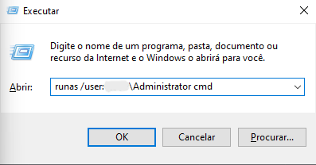
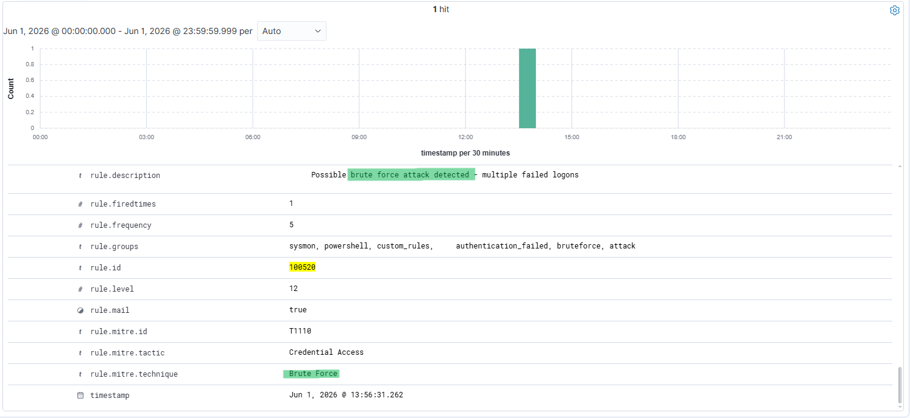
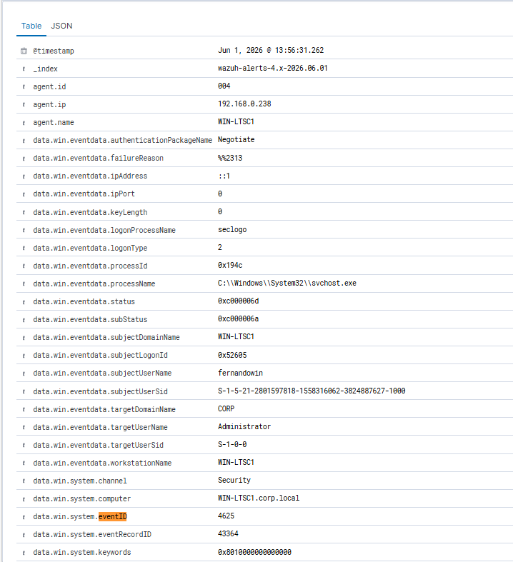
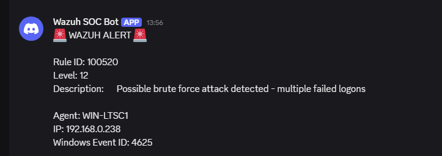
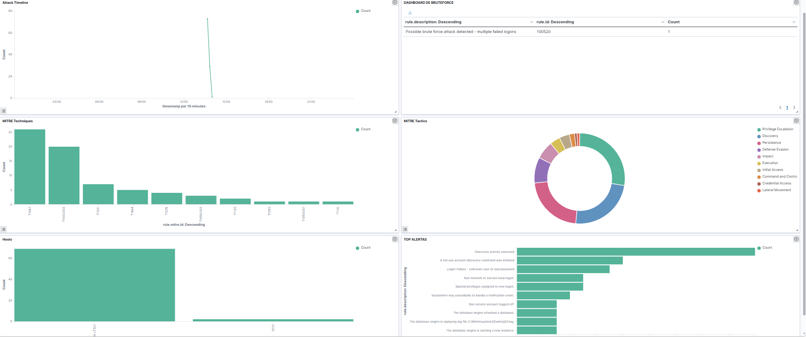

# Incident Report 002

## Incident Name

Brute Force Attack Detection Simulation

## Date

01/06/2026

## Analyst

Fernando Andrade

## Severity

Medium

## Status

Closed

## Executive Summary

An exercise was done to detect, correlate, and create alerts for brute force attacks. Multiple failed login attempts were carried out against a privileged account in a lab environment to test this capability.

Event ID 4625 was created for the activity performed and logged. Wazuh gathered this information, applied a detection rule and mapped the attack to MITRE ATT&CK technique T1110 (Brute Force). An alert was automatically forwarded to Discord through its integration.

The aim of this exercise was to verify the detection and correlation of the SOC laboratory.

## Environment

### Infrastructure

- Wazuh Manager
- Windows LTSC Workstation
- Sysmon
- Windows Security Logs
- Active Directory
- Discord Integration

### Hosts

- WIN-LTSC1

## Attack Simulation

This was simulated using the Windows Runas tool.

The command was run multiple times as follows:

runas /user:LAB\Administrator cmd

Invalid credentials were intentionally provided in order to generate multiple failed authentication events.

The goal of this attack was to simulate a brute force attempt against a privileged account.

## Evidence Collection

### Evidence 1 - Brute Force Simulation

Command used to simulate the attack:

runas /user:LAB\Administrator cmd

Screenshot:

### Evidence 2 – Wazuh Detection

Wazuh was able to detect multiple failed login attempts and trigger a custom correlation rule.

Image:

### Evidence 3 – Failed Logon Event (4625)

The Windows Security event ID 4625 confirmed multiple failed logon attempts to the administrator account.

Image:

### Evidence 4 – Discord Alert

The custom Wazuh integration successfully sent an alert via Discord.

Image:

### Evidence 5 – Dashboard Correlation

A custom dashboard displayed the brute force attack and corresponding MITRE ATT&CK mappings.

Image:

## Analysis

The observed activity is consistent with a brute force attack against a privileged account.

Multiple failed login attempts resulted in multiple entries in Windows Security Event IDs 4625.

A correlation was made by Wazuh based on the custom correlation rule and generated an alert.

Even though the above-mentioned activity was carried out in a lab setting, if it happened in a production environment, it might suggest:

- Password spraying activities
- Credential guesses attempts
- Unsuccessful unauthorized login attempts
- Initial access attempts

Key characteristics noticed:

- Multiple failed logon attempts
- Windows Event ID 4625
- Target account: Administrator
- Wazuh Rule: 100520
- MITRE ATT&CK: T1110
- Alert level: 12

## MITRE ATT&CK Mapping

### T1110 - Brute Force

The test consisted of repeated attempts at authentication with incorrect credentials targeting a privileged account.

### Credential Access

The goal of the simulated activity was to gain access using password guessing techniques.

## Detection Flow

The detection process was carried out according to the following steps:

1. Multiple failed login attempts were performed.
2. Windows logged event ID 4625.
3. Events were collected by Wazuh.
4. Custom Rule 100520 correlated multiple failed attempts within the given timeframe.
5. An alert was mapped to MITRE ATT&CK technique T1110.
6. An alert was sent to Discord via webhooks.

## Response Actions

The following activities were performed in order to investigate the case:

- Checking the occurrence of repeated failed login attempts.
- Verifying the creation of Windows Event ID 4625.
- Confirming Wazuh rules correlating repeated failures.
- Checking MITRE ATT&CK technique mapping.
- Confirming alert delivery to Discord.
- Identifying the simulation activity.

## Conclusion

The SOC laboratory successfully detected and correlated a simulated brute force attack against a privileged account.

The environment showed its capability to detect:

- Windows Security Log monitoring.
- Failed login detections.
- Correlation using custom Wazuh rules.
- MITRE ATT&CK technique mapping.
- Sending alerts automatically using Discord integration.

The simulation validated the effectiveness of the monitoring pipeline and improved understanding of brute force detection workflows.

---

# Tradução (PT-BR)

# Relatório de Incidente 002

## Incidente:

Simulação de detecção de ataque de força bruta

## Data

01/06/2026

## Analista

Fernanda Andrade

## Severidade

Médio

## Status

Fechado

## Resumo

Foi feito um exercício para detectar, correlacionar e criar alertas para ataques de força bruta. Várias tentativas de login fracassadas foram realizadas em uma conta privilegiada em um ambiente de laboratório para testar esse recurso.

O ID do evento 4625 foi criado para a atividade executada e registrada. Wazuh reuniu essas informações, aplicou a regra de detecção e mapeou o ataque para a técnica MITRE ATT&CK T1110 (Brute Force). Um alerta foi encaminhado automaticamente para o Discord através de sua integração.

O objetivo deste exercício foi verificar a detecção e correlação do laboratório SOC.

## Meio Ambiente

### Infraestrutura

- Gerente Wazuh
- Estação de trabalho Windows LTSC
- Sysmon
- Registros de segurança do Windows
- Diretório Ativo
- Integração de discórdia

### Anfitriões

- WIN-LTSC1

## Simulação de Ataque

Isso foi simulado usando a ferramenta Windows Runas.

O comando foi executado várias vezes da seguinte forma:

runas /usuário:LAB\Administrador cmd

Credenciais inválidas foram fornecidas intencionalmente para gerar vários eventos de autenticação com falha.

O objetivo deste ataque era simular uma tentativa de força bruta contra uma conta privilegiada.

## Coleta de evidências

### Evidência 1 - Simulação de Força Bruta

Comando usado para simular o ataque:

runas /usuário:LAB\Administrador cmd

Imagem:

### Evidência 2 – Detecção de Wazuh

Wazuh conseguiu detectar várias tentativas de login malsucedidas e acionar uma regra de correlação personalizada.

Imagem:

### Evidência 3 – Evento de logon com falha (4625)

O evento de segurança do Windows ID 4625 confirmou várias tentativas de logon com falha na conta do administrador.

Imagem:

### Evidência 4 – Alerta de discórdia

A integração personalizada do Wazuh enviou com sucesso um alerta via Discord.

Imagem:

### Evidência 5 – Correlação do Dashboard

Um painel personalizado exibia o ataque de força bruta e os mapeamentos MITRE ATT&CK correspondentes.

Imagem:

## Análise

A atividade observada é consistente com um ataque de força bruta contra uma conta privilegiada.

Várias tentativas de login malsucedidas resultaram em várias entradas nas IDs de eventos de segurança do Windows 4625.

Uma correlação foi feita pelo Wazuh com base na regra de correlação customizada e gerou um alerta.

Embora a atividade acima mencionada tenha sido realizada em ambiente de laboratório, se aconteceu em ambiente de produção, pode sugerir:

- Atividades de pulverização de senha
- Tentativas de suposições de credenciais
- Tentativas de login não autorizadas sem sucesso
- Tentativas iniciais de acesso

Principais características observadas:

- Várias tentativas de login malsucedidas
- ID de evento do Windows 4625
- Conta de destino: Administrador
- Regra Wazuh: 100520
- MITRE ATT&CK: T1110
- Nível de alerta: 12

## Mapeamento MITRE ATT&CK

### T1110 - Força Bruta

O teste consistiu em repetidas tentativas de autenticação com credenciais incorretas direcionadas a uma conta privilegiada.

### Credencial de acesso

O objetivo da atividade simulada foi obter acesso utilizando técnicas de adivinhação de senha.

## Fluxo de detecção

O processo de detecção foi realizado de acordo com as seguintes etapas:

1. Foram realizadas várias tentativas de login com falha.
2. ID de evento registrado do Windows 4625.
3. Os eventos foram coletados por Wazuh.
4. A regra personalizada 100520 correlacionou várias tentativas fracassadas dentro do período determinado.
5. Um alerta foi mapeado para a técnica MITRE ATT&CK T1110.
6. Um alerta foi enviado ao Discord via webhooks.

## Ações de resposta

As seguintes atividades foram realizadas para investigar o caso:

- Verificação da ocorrência de repetidas tentativas de login malsucedidas.
- Verificando a criação do Event ID 4625 do Windows.
- Confirmação das regras Wazuh correlacionando falhas repetidas.
- Verificação do mapeamento da técnica MITRE ATT&CK.
- Confirmando a entrega do alerta ao Discord.
- Identificar a atividade de simulação.

## Conclusão

O laboratório SOC detectou e correlacionou com sucesso um ataque simulado de força bruta contra uma conta privilegiada.

O ambiente mostrou sua capacidade de detectar:

- Monitoramento de log de segurança do Windows.
- Falha nas detecções de login.
- Correlação usando regras Wazuh personalizadas.
- Mapeamento da técnica MITRE ATT&CK.
- Envio de alertas automaticamente usando integração com Discord.

A simulação validou a eficácia do pipeline de monitoramento e melhorou a compreensão dos fluxos de trabalho de detecção de força bruta.

