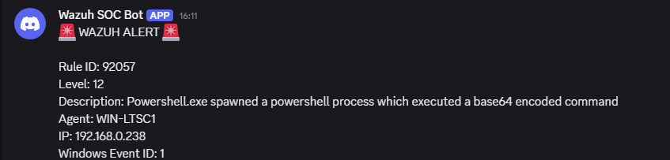

# Incident Report 003

## Incident Name

Detection of PowerShell Encoded Command Execution

## Date

02/06/2026

## Analyst

Fernando Andrade

## Severity

Medium

## Status

Closed

## Executive Summary

A simulation of a PowerShell encoded command execution event was carried out in a SOC laboratory environment in order to assess detection and monitoring capabilities.

The activity led to the creation of Sysmon events, Wazuh detection Rule 92057 being triggered, association with MITRE ATT&CK T1059.001 PowerShell technique and generation of a Discord alert message.

The aim of the exercise was to test and validate PowerShell detection and encoded command monitoring in the SOC lab environment.

## Environment

### Infrastructure

- Wazuh Manager
- Windows LTSC Workstation
- Sysmon
- Windows Security Logs
- Active Directory
- Discord Integration

### Hosts

- WIN-LTSC1

## Attack Simulation

The following encoded PowerShell command was run:

powershell.exe -EncodedCommand VwByAGkAdABlAC0ATwB1AHQAcAB1AHQAIAAiAFMATwBDACAATABhAGIAIABQAG8AdwBlAHIAUwBoAGUAbABsACAAZQBuAGMAbwBkAGUAZAAgAGMAbwBtAG0AYQBuAGQAIAB0AGUAcwB0ACIA

The encoded command had a Base64 encoded payload that was ran for simulation purposes to detect a commonly used malicious behavior.

The objective of the exercise was to detect and validate encoded PowerShell command execution.

## Evidence Collection

### Evidence 1 – Encoded PowerShell Execution

Encoded PowerShell command executed from the workstation.

Image:

### Evidence 2 – Wazuh Detection

Wazuh detected execution of a Base64 encoded PowerShell command and triggered Rule 92057.

Image:

### Evidence 3 – Sysmon Event Collection

Sysmon Event ID 1 recorded the PowerShell process creation event and captured the full command line.

Image:

### Evidence 4 – Discord Alert

The Wazuh Discord integration successfully delivered an alert notification.

Image:

### Evidence 5 – Dashboard Correlation

A dedicated dashboard displayed the detected activity, MITRE ATT&CK mapping, host information, and event timeline.

Image:

## Analysis

The above activity can be seen to indicate the execution of a PowerShell command with the EncodedCommand parameter.

Encoding of malicious commands in Base64 format is one of the most widely used techniques by attackers for obfuscation purposes.

The command in question resulted in generation of Sysmon process creation event that was collected and analyzed by Wazuh.

While the command used in this case was benign, encoding of PowerShell commands is often indicative of:

- Execution of malware
- Post-exploitation activities
- Abuse of PowerShell
- Defense evasion methods
- LoT attack techniques

Execution of encoded PowerShell commands needs investigation in a real-world scenario to assess whether the action is legitimate or not.

Important indicators include:

- EncodedCommand parameter usage
- Creation of PowerShell process
- Sysmon Event ID 1
- Rule 92057 in Wazuh
- MITRE ATT&CK T1059.001
- Alert priority level 12

## Attack Timeline

18:48:20 UTC - Encoded PowerShell command executed.

18:48:20 UTC - Sysmon Event ID 1 raised and captured.

18:48:20 UTC - Wazuh detected base64-encoded command execution.

18:48:20 UTC - Rule 92057 triggered.

18:48:20 UTC - MITRE ATT&CK attack mapped.

18:48:21 UTC - Discord alert message received.

## MITRE ATT&CK Mapping

### T1059.001 – PowerShell

PowerShell was used to execute an encoded command.

### Execution

The operation included executing commands through PowerShell.

## Detection Workflow

The detection workflow went as follows:

1. The PowerShell command was executed with the help of the EncodedCommand parameter.
2. Sysmon Event ID 1 registered the creation of the process.
3. The generated telemetry was collected by Wazuh.
4. Rule 92057 detected an encoded PowerShell command execution.
5. MITRE ATT&CK technique T1059.001 was identified.
6. The data was indexed and shown on the dashboard.
7. Discord notification was delivered with the help of the webhook.

## Response Actions

The following activities were done during the response:

- Process creation by PowerShell was verified.
- Usage of the EncodedCommand parameter was confirmed.
- Sysmon telemetry was reviewed.
- Wazuh detection was confirmed.
- MITRE ATT&CK mapping was validated.
- Alert delivery via Discord was confirmed.
- It was found out that the activity was a part of the lab exercise.

## Conclusion

SOC lab successfully detected and correlated the encoded PowerShell command execution.

The lab showed:

- PowerShell activity monitoring
- Telemetry gathering with Sysmon
- SIEM-based detection with Wazuh
- MITRE ATT&CK mapping
- Data visualization on the dashboard
- Alerting on Discord

In conclusion, SOC laboratory demonstrated its capability to detect and respond to encoded command execution PowerShell activity.
