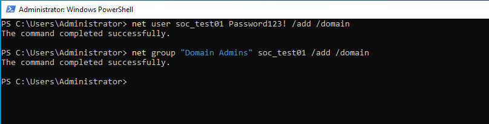
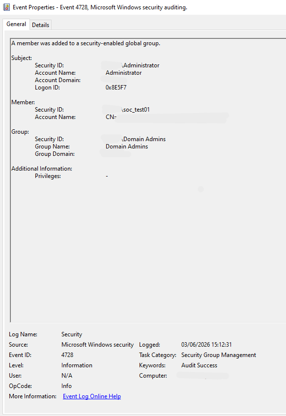
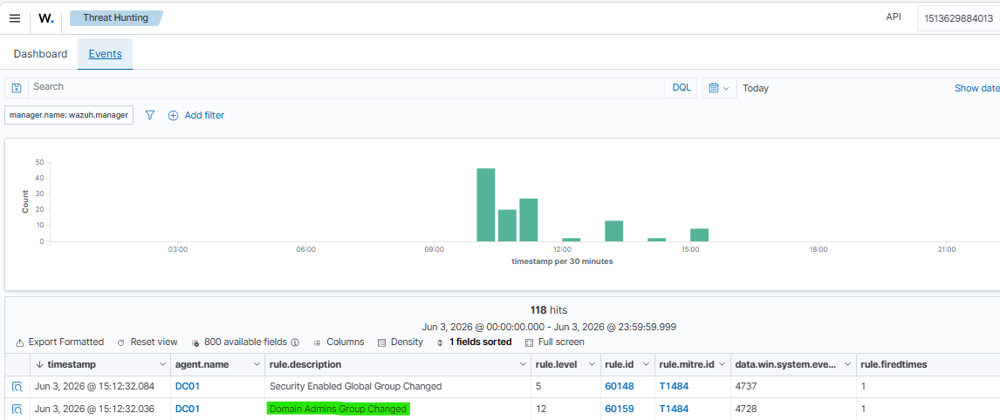
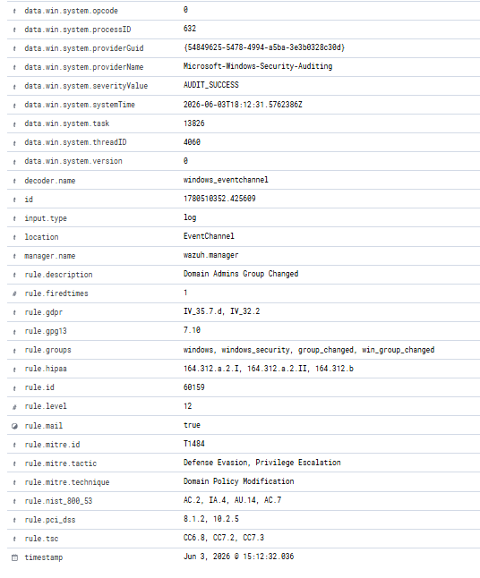
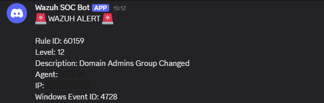

# Incident Report 005

## Incident Name

Privileged Group Membership Change Detection

## Date

03/06/2026

## Analyst

Fernando Andrade

## Severity

High

## Status

Closed

## Executive Summary

A simulation of a privileged group membership modification event was carried out in a SOC laboratory environment in order to assess detection, monitoring, and alerting capabilities.

The activity involved adding a user account to the Domain Admins group within Active Directory. The action generated Windows Security Event ID 4728, which was collected by Wazuh and correlated through Rule 60159.

The event was classified as a high-severity alert and mapped to MITRE ATT&CK T1484 Domain Policy Modification. A Discord notification was successfully delivered, validating end-to-end detection and alerting capabilities.

The aim of the exercise was to test and validate privileged group membership monitoring and privilege escalation detection in the SOC lab environment.

## Environment

### Infrastructure

* Wazuh Manager
* Active Directory
* Domain Controller
* Windows Security Logs
* Windows Event Viewer
* Discord Integration

### Hosts

* DC01

## Attack Simulation

The following command was executed:

```cmd
net user soc_test01 Password123! /add /domain
net group "Domain Admins" soc_test01 /add /domain
```

The command added a user account to the Domain Admins group.

The objective of the exercise was to detect and validate privileged group membership changes and verify whether security monitoring controls would identify the activity.

## Evidence Collection

### Evidence 1 – Group Membership Modification

A user account was added to the Domain Admins group.

Image:



### Evidence 2 – Windows Security Event ID 4728

Windows Security Logs recorded Event ID 4728 indicating that a member was added to a security-enabled global group.

Image:



### Evidence 3 – Wazuh Detection

Wazuh detected the privileged group modification and triggered Rule 60159.

Image:



### Evidence 4 – Alert Details

Alert metadata confirmed the affected group, severity level, event information, and MITRE ATT&CK mapping.

Image:



### Evidence 5 – Discord Alert

The Wazuh Discord integration successfully delivered an alert notification.

Image:



## Analysis

The above activity indicates that a user account was added to the Domain Admins group within Active Directory.

Modification of privileged groups is one of the most important security events in Windows environments because it may provide administrative privileges to users that previously had limited permissions.

Attackers frequently perform privileged group modifications during post-exploitation activities to establish persistence, escalate privileges, and gain broader access across the domain.

The command in question resulted in generation of Windows Security Event ID 4728, which was collected and analyzed by Wazuh.

While the activity performed in this case was benign and executed as part of a laboratory exercise, privileged group membership changes should always be investigated in real-world environments.

Important indicators include:

* Event ID 4728
* Domain Admins group modification
* Administrative account activity
* Rule 60159
* MITRE ATT&CK T1484
* Privilege Escalation
* Alert priority level 12

## Attack Timeline

15:12:31 UTC - User account added to Domain Admins group.

15:12:31 UTC - Windows Security Event ID 4728 generated.

15:12:32 UTC - Wazuh collected the event.

15:12:32 UTC - Rule 60159 triggered.

15:12:32 UTC - MITRE ATT&CK mapping applied.

15:12:32 UTC - Event indexed and displayed in the dashboard.

15:12:32 UTC - Discord alert message received.

## MITRE ATT&CK Mapping

### T1484 – Domain Policy Modification

A privileged Active Directory group was modified.

### Privilege Escalation

The activity resulted in elevated permissions being granted to a user account.

### Defense Evasion

Privileged accounts can be abused to maintain access and avoid restrictions within the environment.

## Detection Workflow

The detection workflow went as follows:

1. A user account was added to the Domain Admins group.
2. Windows Security Event ID 4728 was generated.
3. The generated telemetry was collected by Wazuh.
4. Rule 60159 detected the privileged group modification.
5. MITRE ATT&CK technique T1484 was identified.
6. The data was indexed and shown on the dashboard.
7. Discord notification was delivered through the webhook.

## Response Actions

The following activities were done during the response:

* Privileged group modification was verified.
* Event ID 4728 was reviewed.
* Domain Admins membership change was confirmed.
* Wazuh detection was validated.
* MITRE ATT&CK mapping was verified.
* Alert severity level was reviewed.
* Discord alert delivery was confirmed.
* It was found out that the activity was a part of the lab exercise.

## Conclusion

SOC lab successfully detected and correlated a privileged group membership modification event.

The lab showed:

* Active Directory monitoring
* Privileged group auditing
* Windows Security Log analysis
* SIEM-based detection with Wazuh
* MITRE ATT&CK mapping
* High-severity alert correlation
* Discord alerting
* Incident response documentation

In conclusion, SOC laboratory demonstrated its capability to detect and respond to privileged group membership changes that may indicate privilege escalation activity within a Windows domain environment.

