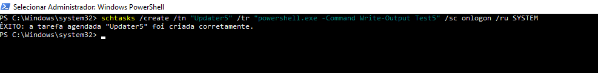
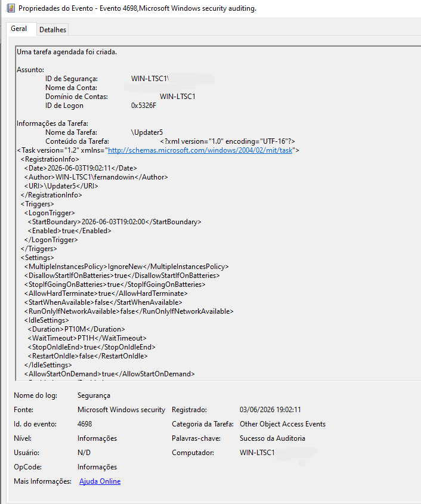
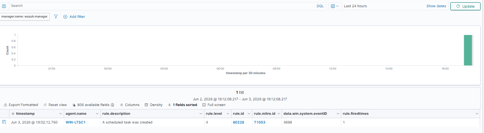
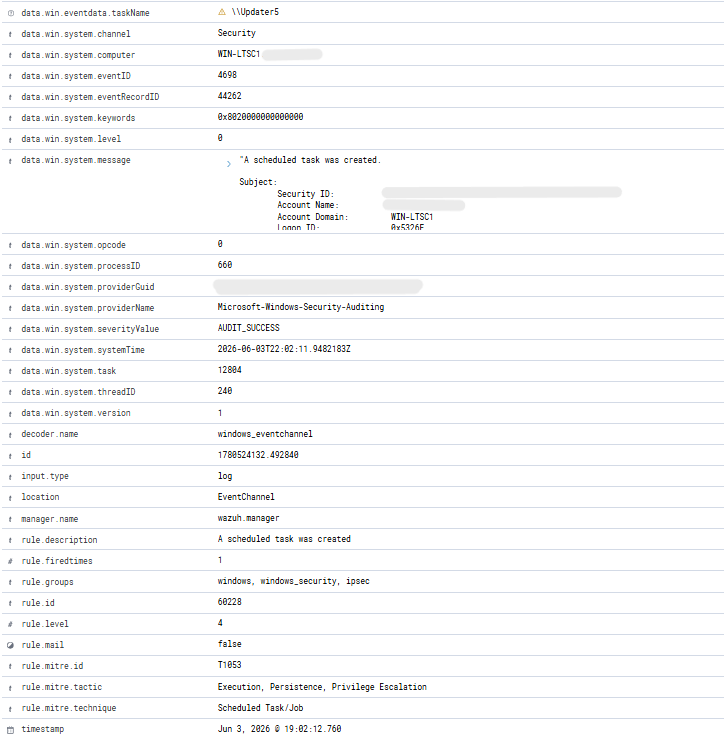
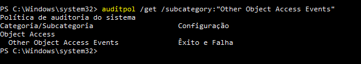

# Incident Report 006

## Incident Name

Scheduled Task Persistence Detection

## Date

03/06/2026

## Analyst

Fernando Andrade

## Severity

High

## Status

Closed

## Executive Summary

A scheduled task persistence technique was simulated in a controlled SOC laboratory environment to validate monitoring, detection, and investigation capabilities.

The activity involved creating a scheduled task configured to execute a PowerShell command at user logon. Windows generated Security Event ID 4698, indicating that a scheduled task had been created. The event was collected by Wazuh and correlated through Rule 60228.

The alert was mapped to MITRE ATT&CK technique T1053 (Scheduled Task/Job), demonstrating the SOC lab's ability to identify persistence mechanisms commonly used by threat actors to maintain access within a compromised environment.

The objective of this exercise was to validate scheduled task monitoring, Windows audit policy configuration, event collection, alert generation, and investigation workflows.

## Environment

### Infrastructure

* Wazuh Manager
* Windows Security Logs
* Windows Event Viewer
* Windows Task Scheduler

### Hosts

* WIN-LTSC1

## Attack Simulation

The following command was executed on the endpoint:

```cmd
schtasks /create /tn "Updater5" /tr "powershell.exe -Command Write-Output Test5" /sc onlogon /ru SYSTEM
```

The command created a scheduled task configured to execute automatically whenever a user logs on to the system.

The objective of the exercise was to simulate a persistence mechanism frequently observed in malware, ransomware, and post-exploitation activities.

## Evidence Collection

### Evidence 1 – Scheduled Task Creation Command

A scheduled task was created using schtasks.exe.

Image:



### Evidence 2 – Windows Security Event ID 4698

Windows Security Logs recorded Event ID 4698, indicating that a scheduled task was created.

Image:



### Evidence 3 – Wazuh Detection

Wazuh successfully detected the scheduled task creation event and generated an alert.

Image:



### Evidence 4 – Alert Details

Alert metadata confirmed the event information, affected host, MITRE ATT&CK mapping, and detection rule.

Image:



### Evidence 5 – Audit Policy Validation

The Windows audit policy responsible for generating Event ID 4698 was verified and confirmed as enabled.

Image:



## Analysis

The activity generated Windows Security Event ID 4698, which is recorded whenever a scheduled task is created on a Windows system.

Scheduled tasks are frequently abused by attackers as a persistence mechanism because they allow malicious commands, scripts, or payloads to execute automatically under specific conditions.

The task created during this exercise was configured to execute at user logon and run under the SYSTEM account. Similar techniques are commonly observed in malware campaigns, ransomware incidents, and post-exploitation activities.

Initially, the scheduled task creation activity was not generating Event ID 4698. Investigation revealed that the required Windows audit policy was not enabled. After enabling the "Other Object Access Events" audit policy through auditpol, Windows successfully generated Event ID 4698 and Wazuh detected the event through Rule 60228.

Important indicators observed during the investigation included:

* Event ID 4698
* Scheduled Task Creation
* Task Name: Updater5
* Rule ID 60228
* MITRE ATT&CK T1053
* Persistence Activity
* SYSTEM Account Execution

## Attack Timeline

19:02:11 UTC - Scheduled task created.

19:02:11 UTC - Windows Security Event ID 4698 generated.

19:02:12 UTC - Wazuh collected the event.

19:02:12 UTC - Rule 60228 triggered.

19:02:12 UTC - MITRE ATT&CK mapping applied.

19:02:12 UTC - Event indexed and displayed in the Wazuh dashboard.

19:02:12 UTC - Investigation initiated and validated.

## MITRE ATT&CK Mapping

### T1053 – Scheduled Task / Job

The attacker creates or modifies a scheduled task to execute malicious code automatically.

### Persistence

Scheduled tasks provide a reliable mechanism for maintaining access across system reboots and user sessions.

### Privilege Escalation

Scheduled tasks may be configured to execute under privileged accounts such as SYSTEM.

### Execution

Scheduled tasks can automatically launch commands, scripts, or executables.

## Detection Workflow

The detection workflow occurred as follows:

1. A scheduled task was created using schtasks.exe.
2. Windows generated Security Event ID 4698.
3. The Wazuh agent collected the event.
4. Wazuh correlated the activity through Rule 60228.
5. MITRE ATT&CK technique T1053 was identified.
6. The event was indexed and displayed in the dashboard.
7. The activity was reviewed and validated by the analyst.

## Response Actions

The following investigation activities were performed:

* Verified scheduled task creation.
* Reviewed Windows Security Event ID 4698.
* Confirmed task configuration and execution settings.
* Validated Windows audit policy configuration.
* Verified Wazuh detection.
* Reviewed MITRE ATT&CK mapping.
* Confirmed event indexing within Threat Hunting.
* Validated that the activity was part of a controlled SOC laboratory exercise.

## Conclusion

The SOC laboratory successfully detected and investigated a scheduled task persistence technique within a Windows environment.

The exercise demonstrated:

* Windows Security Log analysis
* Event ID 4698 investigation
* Scheduled Task monitoring
* Persistence detection
* SIEM-based detection using Wazuh
* MITRE ATT&CK mapping
* Audit policy validation
* Threat Hunting workflows
* Incident response documentation

In conclusion, the SOC laboratory successfully demonstrated its capability to detect, investigate, and document scheduled task persistence activity that may indicate malicious execution or unauthorized persistence within a Windows environment.

