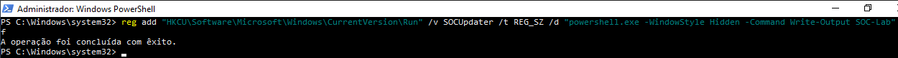
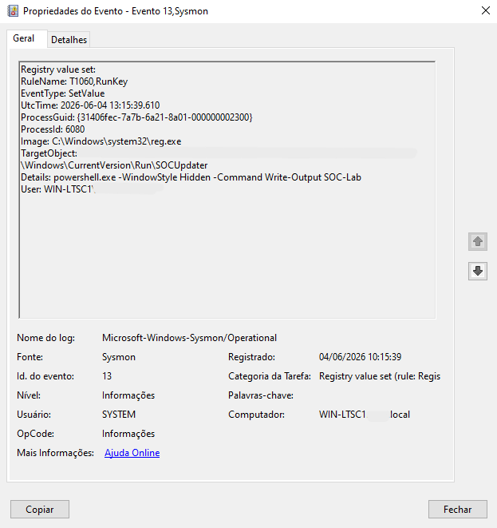
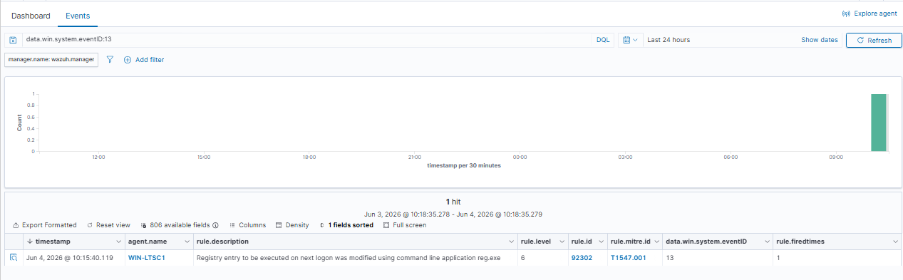
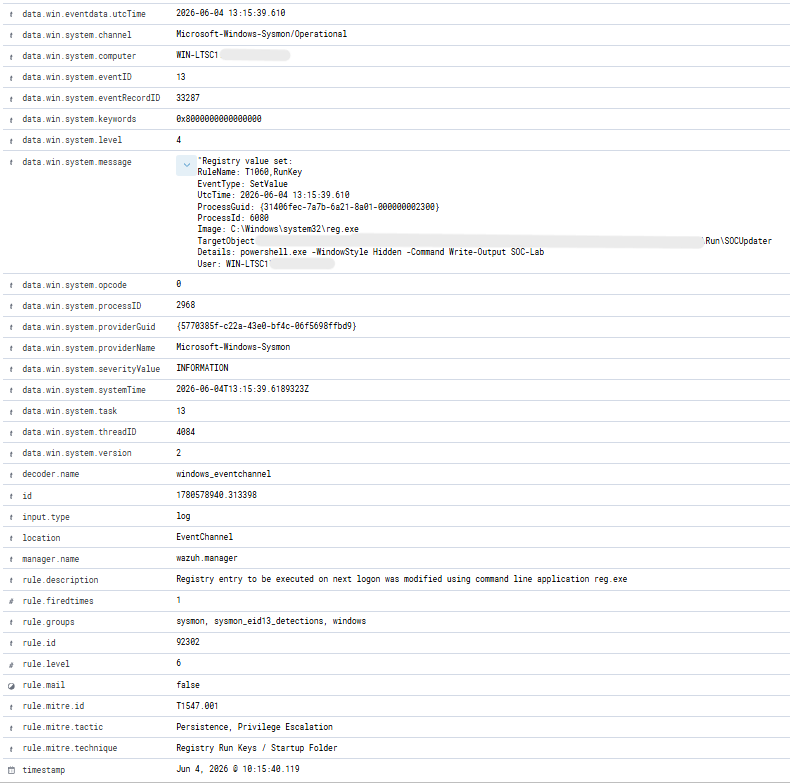
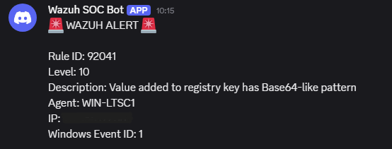

# Incident Report 007

## Incident Name

Registry Modification Detection

## Date

04/06/2026

## Analyst

Fernando Andrade

## Severity

Medium

## Status

Closed

## Executive Summary

A registry modification persistence technique was simulated in a controlled SOC laboratory environment to validate Windows Registry monitoring, Sysmon telemetry collection, Wazuh detection capabilities, MITRE ATT&CK mapping, and Discord alerting.

The activity involved creating a Run Key entry within the Windows Registry to execute a PowerShell command automatically at user logon. Sysmon generated Event ID 13 (Registry Value Set), which was successfully collected and analyzed by Wazuh.

The generated alert was mapped to MITRE ATT&CK technique T1547.001 (Registry Run Keys / Startup Folder), demonstrating the SOC laboratory's ability to identify persistence mechanisms commonly used by malware, ransomware, and post-exploitation frameworks.

Additionally, a related Level 10 alert was forwarded to Discord, validating real-time notification workflows.

## Environment

### Infrastructure

* Wazuh Manager
* Sysmon
* Windows Event Viewer
* Discord Alert Integration

### Hosts

* WIN-LTSC1

## Attack Simulation

The following command was executed on the endpoint:

```cmd
reg add "HKCU\Software\Microsoft\Windows\CurrentVersion\Run" /v SOCUpdater /t REG_SZ /d "powershell.exe -WindowStyle Hidden -Command Write-Output SOC-Lab" /f
```

The command created a Run Key entry designed to execute automatically when the user logs on to the system.

This persistence mechanism is frequently abused by malware families, remote access trojans (RATs), loaders, and post-exploitation toolkits.

## Evidence Collection

### Evidence 1 – Registry Modification Command

A registry Run Key was created using reg.exe.

Image:



### Evidence 2 – Sysmon Event ID 13

Sysmon generated Event ID 13 indicating that a registry value was modified.

Image:



### Evidence 3 – Wazuh Detection

Wazuh detected the registry modification activity and generated an alert based on Sysmon telemetry.

Image:



### Evidence 4 – Alert Details

Alert metadata confirmed the modified registry path, process information, MITRE ATT&CK mapping, and detection rule.

Image:



### Evidence 5 – Discord Notification

A related Level 10 alert was successfully forwarded to the Discord notification channel.

Image:



## Analysis

The activity generated Sysmon Event ID 13, indicating a registry value modification operation.

The modified registry path was:

```text
HKCU\Software\Microsoft\Windows\CurrentVersion\Run\SOCUpdater
```

The Run Key contained the following command:

```text
powershell.exe -WindowStyle Hidden -Command Write-Output SOC-Lab
```

Registry Run Keys are frequently leveraged by threat actors to establish persistence because they allow malicious code to execute automatically during user logon.

Sysmon successfully captured the modification event and forwarded the telemetry to Wazuh. The event triggered Rule 92302, which identified the activity as a Registry Run Key modification.

Additionally, a Level 10 alert was generated and delivered to Discord, demonstrating real-time alerting capabilities.

Key indicators observed during the investigation included:

* Event ID 13
* Registry Value Set
* reg.exe
* Registry Run Key Modification
* Rule ID 92302
* MITRE ATT&CK T1547.001
* PowerShell Execution Persistence
* Discord Alert Notification

## Attack Timeline

10:15:39 UTC - Registry Run Key created.

10:15:39 UTC - Sysmon Event ID 13 generated.

10:15:40 UTC - Wazuh collected the event.

10:15:40 UTC - Rule 92302 triggered.

10:15:40 UTC - MITRE ATT&CK mapping applied.

10:15:40 UTC - Alert indexed within Wazuh.

10:15:40 UTC - Discord notification generated.

10:15:40 UTC - Investigation initiated and validated.

## MITRE ATT&CK Mapping

### T1547.001 – Registry Run Keys / Startup Folder

Adversaries may establish persistence by modifying Run Keys within the Windows Registry.

### Persistence

Registry Run Keys automatically execute commands when a user logs on to the system.

### Privilege Escalation

Registry modifications may be leveraged to facilitate execution of privileged code or malicious payloads.

## Detection Workflow

The detection workflow occurred as follows:

1. A registry Run Key was created using reg.exe.
2. Sysmon generated Event ID 13.
3. The Wazuh agent collected the event.
4. Wazuh correlated the activity through Rule 92302.
5. MITRE ATT&CK technique T1547.001 was identified.
6. The event was indexed within Wazuh.
7. A Level 10 alert was forwarded to Discord.
8. The activity was reviewed and validated by the analyst.

## Response Actions

The following investigation activities were performed:

* Verified registry modification activity.
* Reviewed Sysmon Event ID 13.
* Confirmed registry path modification.
* Validated persistence behavior.
* Verified Wazuh detection.
* Reviewed MITRE ATT&CK mapping.
* Validated Discord alert delivery.
* Confirmed event indexing within Threat Hunting.
* Verified that the activity was part of a controlled SOC laboratory exercise.

## Conclusion

The SOC laboratory successfully detected and investigated a registry modification persistence technique within a Windows environment.

The exercise demonstrated:

* Registry monitoring
* Sysmon Event ID 13 investigation
* Persistence detection
* Windows Registry analysis
* Wazuh alert investigation
* MITRE ATT&CK mapping
* Discord alerting
* Threat Hunting workflows
* Incident response documentation

In conclusion, the SOC laboratory successfully demonstrated its capability to detect, investigate, and document registry-based persistence activity commonly associated with malware, ransomware, and post-exploitation techniques.

