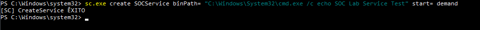
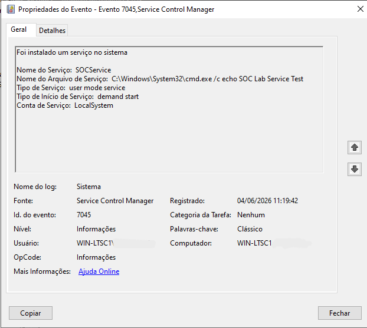
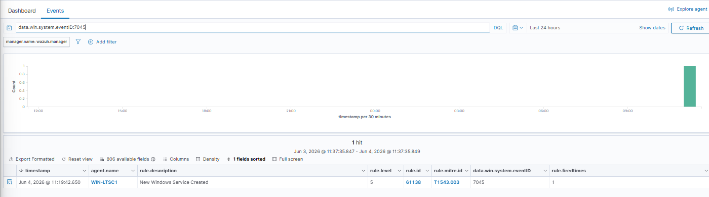
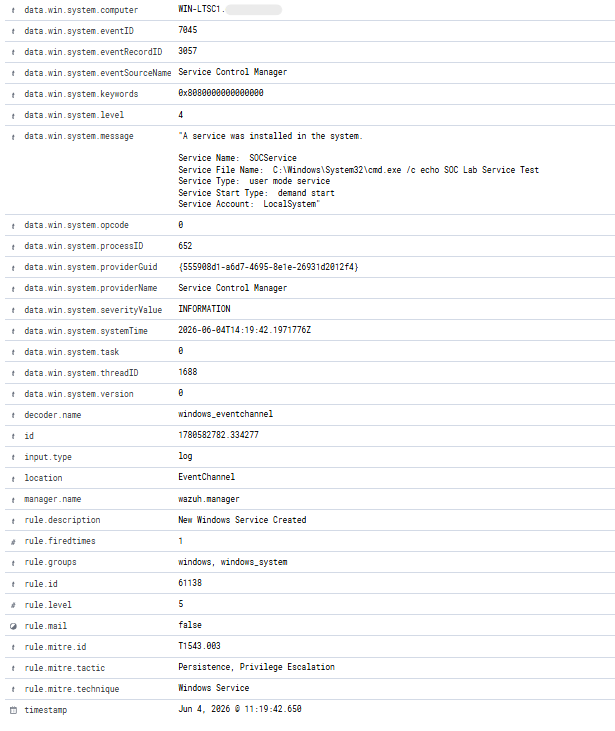
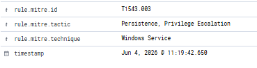

# Incident Report 008

## Incident Name

Service Creation Detection

## Date

04/06/2026

## Analyst

Fernando Andrade

## Severity

High

## Status

Closed

## Executive Summary

A Windows Service creation technique was simulated in a controlled SOC laboratory environment to validate Windows Service monitoring, Wazuh detection capabilities, MITRE ATT&CK mapping, and threat hunting workflows.

The activity involved creating a new Windows Service using the Service Control (sc.exe) utility. Windows generated Event ID 7045, indicating that a new service was installed on the system. Wazuh successfully collected and analyzed the event, generating a detection mapped to MITRE ATT&CK technique T1543.003 (Create or Modify System Process: Windows Service).

The objective of this exercise was to validate service creation monitoring, event collection, alert generation, investigation procedures, and documentation workflows commonly used within Security Operations Centers (SOC).

## Environment

### Infrastructure

* Wazuh Manager
* Windows Event Viewer
* Windows Services
* Threat Hunting Dashboard

### Hosts

* WIN-LTSC1

## Attack Simulation

The following command was executed on the endpoint:

```cmd
sc.exe create SOCService binPath= "C:\Windows\System32\cmd.exe /c echo SOC Lab Service Test" start= demand
```

The command created a new Windows Service named SOCService.

This technique is commonly abused by threat actors to establish persistence, execute malicious payloads, deploy malware, and maintain privileged access on compromised systems.

## Evidence Collection

### Evidence 1 – Service Creation Command

A new Windows Service was created using sc.exe.

Image:



### Evidence 2 – Windows Event ID 7045

Windows recorded Event ID 7045 indicating that a new service was installed on the system.

Image:



### Evidence 3 – Wazuh Detection

Wazuh successfully detected the service creation activity and generated an alert.

Image:



### Evidence 4 – Alert Details

Alert metadata confirmed the service name, executable path, MITRE ATT&CK mapping, and detection rule.

Image:



### Evidence 5 – MITRE ATT&CK Mapping

MITRE ATT&CK mapping validated the persistence and privilege escalation technique associated with Windows Services.

Image:



## Analysis

The activity generated Windows Event ID 7045, which is logged whenever a new Windows Service is installed on a system.

The created service was:

```text
SOCService
```

Configured executable:

```text
C:\Windows\System32\cmd.exe /c echo SOC Lab Service Test
```

Windows Services are frequently leveraged by threat actors to maintain persistence and execute code with elevated privileges.

Wazuh successfully detected the service installation event and generated Rule ID 61138, identifying the activity as a Windows Service creation event.

Key indicators observed during the investigation included:

* Event ID 7045
* New Windows Service Created
* Service Name: SOCService
* Rule ID 61138
* MITRE ATT&CK T1543.003
* Windows Service Persistence
* Service Control Manager Activity

## Attack Timeline

11:19:42 UTC - Service creation command executed.

11:19:42 UTC - Windows Event ID 7045 generated.

11:19:42 UTC - Event collected by Wazuh.

11:19:42 UTC - Rule 61138 triggered.

11:19:42 UTC - MITRE ATT&CK mapping applied.

11:19:42 UTC - Event indexed within Threat Hunting.

11:19:42 UTC - Investigation initiated and validated.

## MITRE ATT&CK Mapping

### T1543.003 – Create or Modify System Process: Windows Service

Adversaries may create or modify Windows Services to execute malicious code and maintain persistence.

### Persistence

Windows Services can automatically start during system boot and remain active across reboots.

### Privilege Escalation

Services may execute under highly privileged accounts such as LocalSystem, providing elevated access to adversaries.

## Detection Workflow

The detection workflow occurred as follows:

1. A new Windows Service was created using sc.exe.
2. Windows generated Event ID 7045.
3. The Wazuh agent collected the event.
4. Wazuh correlated the activity through Rule 61138.
5. MITRE ATT&CK technique T1543.003 was identified.
6. The event was indexed within Wazuh.
7. The activity was reviewed and validated by the analyst.

## Response Actions

The following investigation activities were performed:

* Verified service creation activity.
* Reviewed Windows Event ID 7045.
* Confirmed service configuration.
* Validated executable path.
* Verified Wazuh detection.
* Reviewed MITRE ATT&CK mapping.
* Confirmed event indexing within Threat Hunting.
* Verified that the activity was part of a controlled SOC laboratory exercise.

## Conclusion

The SOC laboratory successfully detected and investigated a Windows Service creation technique within a Windows environment.

The exercise demonstrated:

* Windows Service monitoring
* Event ID 7045 investigation
* Persistence detection
* Privilege escalation monitoring
* Wazuh alert investigation
* MITRE ATT&CK mapping
* Threat Hunting workflows
* Incident response documentation

In conclusion, the SOC laboratory successfully demonstrated its capability to detect, investigate, and document Windows Service creation activity commonly associated with persistence mechanisms, malware deployment, and post-exploitation techniques.

