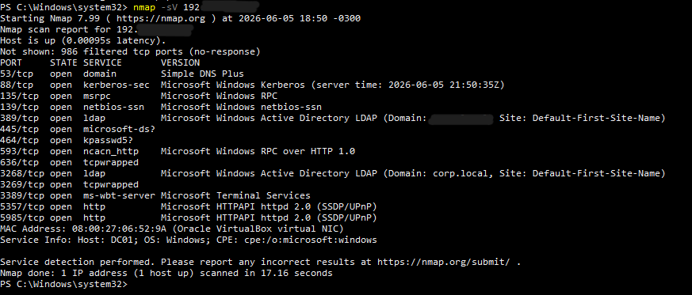
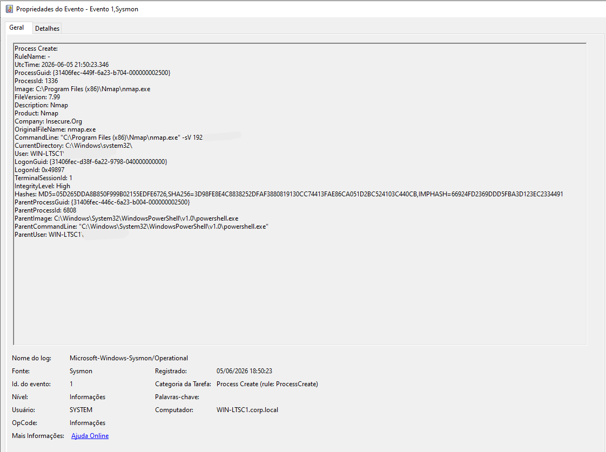
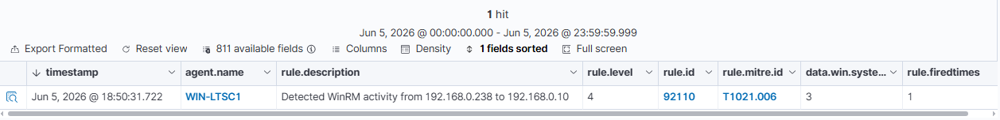
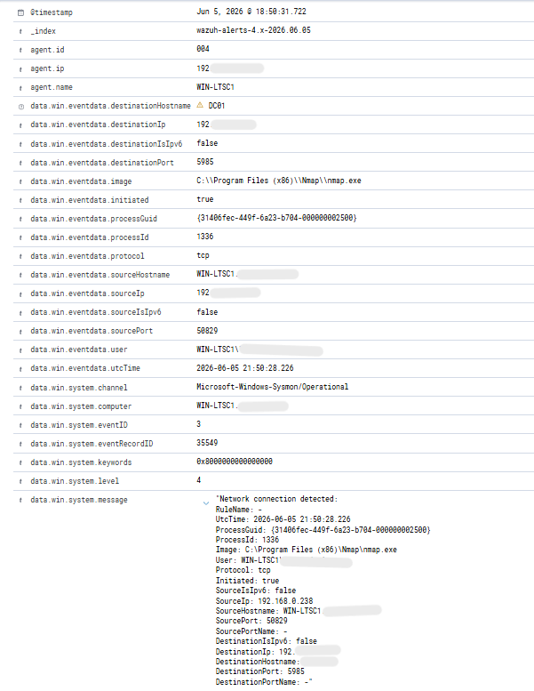

# Incident 010 – Nmap Network Service Discovery Detection

## Overview

This incident simulates network service discovery activity using Nmap against a Domain Controller in a controlled Active Directory lab environment. The objective was to identify exposed services and validate the visibility provided by Sysmon and Wazuh during reconnaissance activity.

The scan was executed from the Windows endpoint (WIN-LTSC1) against the Domain Controller (DC01). Sysmon successfully recorded the execution of nmap.exe and the resulting network connections, while Wazuh generated alerts associated with service discovery activity involving Windows Remote Management (WinRM).

This simulation demonstrates how reconnaissance techniques can be identified before an attacker advances to privilege escalation, lateral movement, or persistence phases.

---

## Environment

### Attacker Host

* WIN-LTSC1
* Windows 10 IoT Enterprise LTSC 2021
* Sysmon Installed
* Wazuh Agent Installed

### Target Host

* DC01
* Windows Server Domain Controller
* Active Directory Domain Services
* Wazuh Agent Installed

### Security Stack

* Wazuh Manager
* Wazuh Dashboard
* Sysmon (SwiftOnSecurity Configuration)

---

## Attack Simulation

The following command was executed from WIN-LTSC1:

```cmd
nmap -sV 192.168.0.10
```

The scan performed service and version detection against the Domain Controller, identifying exposed services including:

* DNS
* Kerberos
* RPC
* LDAP
* SMB
* WinRM
* Remote Desktop Services

---

## Detection Process

### Evidence 01 – Nmap Service Scan Execution

The Nmap scan successfully identified multiple services exposed by the Domain Controller.



---

### Evidence 02 – Sysmon Process Creation

Sysmon Event ID 1 captured the execution of nmap.exe.

Relevant fields:

```text
Image:
C:\Program Files (x86)\Nmap\nmap.exe

CommandLine:
nmap.exe -sV 192.168.0.10

User:
WIN-LTSC1\******
```



---

### Evidence 03 – Wazuh Detection

Wazuh received and processed Sysmon network activity generated by Nmap during service discovery.

Generated Alert:

```text
Rule ID: 92110

Description:
Detected WinRM activity from 192.168.0.238 to 192.168.0.10
```

MITRE Mapping:

```text
T1021.006 - Windows Remote Management
```



---

### Evidence 04 – Wazuh Alert Investigation

Investigation of the generated alert revealed a network connection initiated by nmap.exe against the Domain Controller.

Relevant fields:

```text
Image:
C:\Program Files (x86)\Nmap\nmap.exe

Destination IP:
192.168.0.10

Destination Host:
DC01

Destination Port:
5985

Protocol:
TCP
```

The destination port 5985 corresponds to Windows Remote Management (WinRM), which was detected during the service enumeration phase.



---

## Analysis

The activity observed in this incident is consistent with reconnaissance behavior commonly performed during the early stages of an intrusion.

Attackers frequently use tools such as Nmap to:

* Identify active hosts
* Discover exposed services
* Enumerate attack surfaces
* Locate administrative interfaces
* Identify remote management protocols
* Gather information for later attack stages

The generated Wazuh alert highlighted communication with WinRM, a protocol frequently leveraged by adversaries for remote administration and lateral movement after initial access.

Although the primary objective of the simulation was service discovery, the scan provided visibility into services that could later become targets for exploitation or unauthorized remote access.

---

## MITRE ATT&CK Mapping

### Primary Technique

**T1046 – Network Service Discovery**

Adversaries may scan networks and systems to identify available services, ports, and attack paths.

### Additional Detection Observed

**T1021.006 – Remote Services: Windows Remote Management**

The scan identified and interacted with the WinRM service during the enumeration process.

---

## Response Actions

Performed actions:

* Executed Nmap service and version scan
* Confirmed Sysmon logging of process creation activity
* Confirmed Sysmon logging of network connection activity
* Validated Wazuh alert generation
* Investigated network communication details
* Correlated findings with MITRE ATT&CK techniques
* Documented reconnaissance indicators for threat hunting purposes

---

## Lessons Learned

* Nmap execution is clearly visible through Sysmon Event ID 1 telemetry.
* Network connections generated during reconnaissance activity can be captured through Sysmon Event ID 3.
* Wazuh successfully detected and indexed activity associated with service discovery.
* WinRM services provide valuable indicators during threat hunting and reconnaissance investigations.
* Early detection of network discovery activity can provide defenders with opportunities to identify adversaries before lateral movement or persistence is established.

---

## Conclusion

This incident successfully demonstrated the detection and investigation of network service discovery activity using Nmap within a Windows Active Directory environment.

Sysmon captured both process creation and network connection events generated during the scan, while Wazuh successfully indexed and alerted on related network activity. The investigation validated end-to-end visibility across the telemetry pipeline, from attack execution to SIEM detection.

This scenario reinforces the importance of monitoring reconnaissance techniques, as they often represent the first observable stage of an attack and provide defenders with an opportunity for early detection and response.
